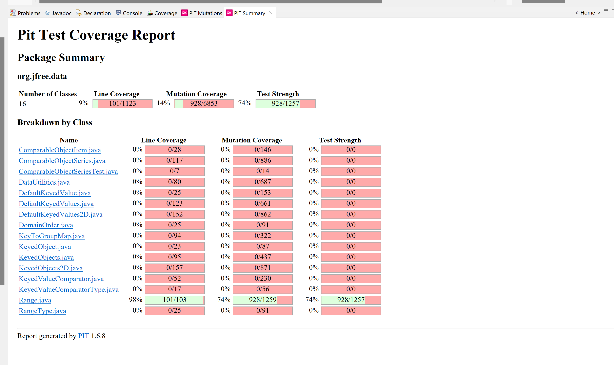

**SENG 438 - Software Testing, Reliability, and Quality**

**Lab. Report \#4 – Mutation Testing and Web app testing**

| Group \#: 18            |
| ------------------------|
| Mohammed Momin Ali Khan | 
| Nicole Zacaruk          |
| Braden Foley            |
| Ethan Sengsavang        |

# Introduction
The lab was divided into two sections, namely Mutation Testing and GUI Testing. In the first section, we checked mutation faults in a Java code-base by using a mutation testing tool and learnt how to interpret the mutation scores and used that information to create new test cases, thereby improving the quality of the overall test suite. The second section focuses on the widely used method of GUI test automation. We used Selenium, a well-known tool for web interface testing, and compared it with an alternative tool.

# Analysis of 10 Mutants of the Range class 

### Test Suites used: 
testGetCentralValueRange1(), testGetCentralValueRange2(), testGetCentralValueRange3()

### Mutants contained in the method: 
getCentralValue()

- **Mutant 1**: Substituted 2.0 with 1.0 → KILLED
- **How it was killed or not**: The mutant initially survived however, when substituted with 1, our test would fail and hence kill the mutant. This results in the **mutant being killed**.

- **Mutant 2**: Replaced double division with multiplication → KILLED
- **How it was killed or not**: This mutant changes the division operator to multiplication, however, our test identified and since the expected value did not match, the mutant was killed. Hence, the result of **mutant being killed**.

- **Mutant 3**: Replaced double addition with subtraction → KILLED
- **How it was killed or not**: This mutant changes the addition operator of the double input to subtraction, however, our test identified and since the expected value did not match, the mutant was killed. Hence, the result of **mutant being killed**.

- **Mutant 4**: replaced double return with 0.0d for org/jfree/data/Range::getCentralValue → KILLED
- **How it was killed or not**: This mutant changes the return value of the getCentralValue, however, our test identified and since the expected function value did not match, the mutant was killed. Hence, the result of **mutant being killed**.

- **Mutant 5**: Replaced double addition with multiplication → KILLED
- **How it was killed or not**: This mutant changes the operator being used from addition of the double numbers to multiplication, however, our test identified that and since the expected function value did not match, the mutant was killed. Hence, the result of **mutant being killed**.

- **Mutant 6**: Negated double field upper → KILLED
- **How it was killed or not**: This mutant changes the double field upper value to be negative, however, we have a test case for that which was identified and since the expected function value did not match, the mutant was killed. Hence, the result of **mutant being killed**.

- **Mutant 7**: Negated double field upper → KILLED
- **How it was killed or not**: This mutant changes the double field upper value to be negative, however, we have a test case for that which was identified and since the expected function value did not match, the mutant was killed. Hence, the result of **mutant being killed**.

- **Mutant 8**: replaced return of double value with -(x + 1) for org/jfree/data/Range::getCentralValue → KILLED
- **How it was killed or not**: This mutant changes the double return value to be negative of (x+1), but the test cases defined and mentioned above as well, this mutant was identified and since the expected function value did not match, the mutant was killed. Hence, the result of **mutant being killed**.

- **Mutant 9**: Incremented (a++) double field lower → SURVIVED
- **How it was killed or not**: This mutant changes the double field lower's value after and increments it and is identified as an equivalent mutant. Since this change is a local change, it does not exist anymore when the test returns and hence, the result of **mutant surviving**.

- **Mutant 10**: Decremented (a--) double field lower → SURVIVED
- **How it was killed or not**: This mutant changes the double field lower's value after and decrements it and is identified as an equivalent mutant. Since this change is a local change, it does not exist anymore when the test returns and hence, the result of **mutant surviving**.

# Report all the statistics and the mutation score for each test class

Range Before:

Range After:

DataUtilities Before:

DataUtilities After:

# Analysis drawn on the effectiveness of each of the test classes

## Range Class

Upon reviewing the efficacy of our mutation coverage for the range test class, we identified several crucial factors. One significant finding was that our initial mutation coverage was only 62%, which was surprising since we had achieved high coverage but we figured out that the mutation coverage was not high enough still in the previous assignment. Upon further inspection of the summary log, we discovered that certain areas of the code were not receiving as much testing as we had anticipated, resulting in a high number of surviving mutants, particularly equivalence mutants. To address this issue, we decided to create new test cases for our previous test suites with a focus on targeting these equivalence mutants and increasing mutation coverage by eliminating numerous mutants with a single test. We noted that the get() methods, expands(), and equals() contained a large number of surviving mutants. To increase the mutation coverage over the 10% threshold, we tried to create detailed and specific test cases for these methods. We eventually included new tests and even for the class shiftWithNoZeroCrossing(), but it is still important to note that the presence of equivalence mutants adversely affects the accuracy of the mutation score. Several tests were added and some of them are: testIntersectsOneNanRange(), testGetCentralValueRange1(),shiftTestNoCrossPositiveBounds().

## DataUtilities Class

The core issue within tests were that mocked classes were not robust enough to detect when exceptions were supposed to be thrown. An example of this could be seen with the conditional checks within the for loops of methods like `calculateRowTotal`. Particularly within `calculateRowTotal`, these situations led the mocked object to return `null` on an index equal to the size of the column being traversed. Therefore, additional boundry checks, and proper exception *throwing* were created to ensure these mutants are caught.

# A discussion on the effect of equivalent mutants on mutation score accuracy

Equivalent mutants lowers score accuracy as an error is added, but the behaviour is the same. As a result, it is difficult for a test to determine if a mutant was created as there is no direct change in the behaviour of the tested method itself. However, Equivalent mutants are still notable, as it may be the case that those mutations do not affect the value returned from a method, but possibly values that were passed into the method as parameters, particularly via reference over value.

# A discussion of what could have been done to improve the mutation score of the test suites

A better mutation score could be achieved by more robust tests, accounting for values above and below the boundries of equivalent classes. Along with this, proper exception throwing within any mocked objects can catch mutations that would generally be illogical. These cases include when the inputted index of a mocked array-like object goes out of bounds, for example.

# Why do we need mutation testing? Advantages and disadvantages of mutation testing

Mutation testing is really helpful as it can identify issues that were originally not caught within other tests with 100% coverage. Although 100% path or branch coverage is achieved, there could continue to be edge cases that are left unconsidered by the developer that may persist. By generating purposefully buggy, but all-around similar code, a tester can be confident that a test case is effective when that mutation is caught. As a result, mutation testing is beneficial for validating the strength of a test suite.

### Advantages

- Thorough and deliberate
    - if an issue were to exist within a test case, it can be easily identified if a mutation is left uncaught.
- Simple in concept
    - it may be easier to discuss issues with mutation coverage  or strength across a team
- may identify additional bugs within the software
    - Although its primary function is to check the strength of a test suite, if a very particular case were to spring up within a source code, that is another possible source of failure that has been identified and can be fixed.

### Disadvantages

- Very time and resource consuming
    - The process to make several small changes to a large code base is extremely lengthy and costly
- False positives may arise
    - as discussed above, equivalent mutations may lead to inaccuracies about a test suite's strength coverage. As a computer is simply making practically random adjustments to values, the mutations may lead to logically equivalent code which would not be an issue at all.

# Explain your SELENUIM test case design process
We chose to run our tests on the Ikea web page. To design tests, 2 functionilties was first assigned to each group member then individually we chose different input data to test the function. We ensured each funtion had at least 2 sets of input data resulting in 16 tests overall.

# Explain the use of assertions and checkpoints
Each selenium test has at least one verification checkpoint manually added to them which runs automatically when the tests are run. In general, these verifications were added at the end of the test to ensure the final page displays the expected result. The verifications include things like confirming the title of the page matches the expected title after a search was conducted, verifying the total of the cart once an item is added, verifying the appropriate color is displayed when filtering items by color, etc.

# How did you test each functionaity with different test data
-For testing the search function, a search was done for different items, checking that relevant products showed up for each search.

-For create account functionality, an account was attempted to be created with invalid data/missing information fields to ensure an error would occur when creaing the account, then an count was created with valid fields and successfully ceates the account.

-For filtering a product, using the same base product of a couch, the results were then filtered in two different manners, first filtered to view gray couches, then filtered to view red couches.

-For loging in, an attempt was made first with invalid login information and then with valid login information.

-For changing the language of the website, the two input data was selecting two different laguages two separate laguages to translate to

-For selecting cookie prefrences on the website, the first selection was allowing all cookies and the second input data was selecting to block all cookies

-For checking out, the function was tested both with items in the cart as well as with an empty cart, expecting the empty cart will not allow the action to occur

-For entering a postal code to show your location, it was tested once with a valid postal code, and one with an invalid postal code

# Discuss advantages and disadvantages of Selenium vs. Sikulix
Selenium is far more user friendly and can be easily set up and ran with little background knowledge whereas Sikulix is more complex and requires some prior knowledge of how to run the program before it can be used. However, selenium is only useful for testing web applications as it's integrated with the web browser. Sikulix on the other hand is downloaded to a device and can be used to test GUI not accesible on a web browser. Sikulix relies on image recognition and requires images to be stored in order to match ith what's visible on screen whereas selenium uses HTML locators to automate it's tests making it more conducive to regression testing.

# How the team work/effort was divided and managed

- Team members were tasked to fix an equal number of functions across the `DataUtilities` and `Range` classes for the mutation tests. Each individual was also responsible for adding test cases as needed to each test class.
- Selenium tests were distributed equally such that each team member was tasked to perform at least two tests involving different values. All tests were performed on the same website, `ikea.com`, which was decided beforehand

# Difficulties encountered, challenges overcome, and lessons learned
Once again we had run into issues when setting up our projects with some of the Github instructions being vague or unclear which lead to a signifigant amount of troubleshooting before being able to start the lab. There were additional issues when dealing with our JMock tests that arose from limited knowledge prior to working with it and some unintuitive logic compared to previous testing programs. However, a new way of understanding can only really benefit an individual in the long run. As for our Selenium test scripts we encountered several issues, were in several circumstances lead to team members having to recreate their entire test suite. It seems most probable that the issues aross from there being cached data from previous script executions that would cause subsequent tests to fail or crash. 

# Comments/feedback on the lab itself
The lab having PIT testing and GUI testing required a lot of additional time to be accomidated towards this lab as opposed to previous assignments. However, Selenium was definitely a fancinating program to work with when it functioned correctly.
