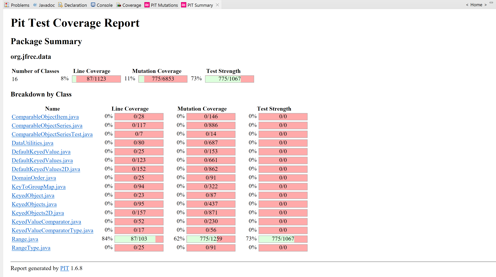

**SENG 438 - Software Testing, Reliability, and Quality**

**Lab. Report \#4 – Mutation Testing and Web app testing**

| Group \#: 18            |
| ------------------------|
| Mohammed Momin Ali Khan | 
| Nicole Zacaruk          |
| Braden Foley            |
| Ethan Sengsavang        |

# Introduction
The lab was divided into two sections, namely Mutation Testing and GUI Testing. In the first section, we checked mutation faults in a Java code-base by using a mutation testing tool and learnt how to interpret the mutation scores and used that information to create new test cases, thereby improving the quality of the overall test suite. The second section focuses on the widely used method of GUI test automation. We used Selenium, a well-known tool for web interface testing, and compared it with an alternative tool.

# Analysis of 10 Mutants of the Range class 

### Test Suites used: 
testGetCentralValueRange1(), testGetCentralValueRange2(), testGetCentralValueRange3()

### Mutants contained in the method: 
getCentralValue()

- **Mutant 1**: Substituted 2.0 with 1.0 → KILLED
- **How it was killed or not**: The mutant initially survived however, when substituted with 1, our test would fail and hence kill the mutant. This results in the **mutant being killed**.

- **Mutant 2**: Replaced double division with multiplication → KILLED
- **How it was killed or not**: This mutant changes the division operator to multiplication, however, our test identified and since the expected value did not match, the mutant was killed. Hence, the result of **mutant being killed**.

- **Mutant 3**: Replaced double addition with subtraction → KILLED
- **How it was killed or not**: This mutant changes the addition operator of the double input to subtraction, however, our test identified and since the expected value did not match, the mutant was killed. Hence, the result of **mutant being killed**.

- **Mutant 4**: replaced double return with 0.0d for org/jfree/data/Range::getCentralValue → KILLED
- **How it was killed or not**: This mutant changes the return value of the getCentralValue, however, our test identified and since the expected function value did not match, the mutant was killed. Hence, the result of **mutant being killed**.

- **Mutant 5**: Replaced double addition with multiplication → KILLED
- **How it was killed or not**: This mutant changes the operator being used from addition of the double numbers to multiplication, however, our test identified that and since the expected function value did not match, the mutant was killed. Hence, the result of **mutant being killed**.

- **Mutant 6**: Negated double field upper → KILLED
- **How it was killed or not**: This mutant changes the double field upper value to be negative, however, we have a test case for that which was identified and since the expected function value did not match, the mutant was killed. Hence, the result of **mutant being killed**.

- **Mutant 7**: Negated double field upper → KILLED
- **How it was killed or not**: This mutant changes the double field upper value to be negative, however, we have a test case for that which was identified and since the expected function value did not match, the mutant was killed. Hence, the result of **mutant being killed**.

- **Mutant 8**: replaced return of double value with -(x + 1) for org/jfree/data/Range::getCentralValue → KILLED
- **How it was killed or not**: This mutant changes the double return value to be negative of (x+1), but the test cases defined and mentioned above as well, this mutant was identified and since the expected function value did not match, the mutant was killed. Hence, the result of **mutant being killed**.

- **Mutant 9**: Incremented (a++) double field lower → SURVIVED
- **How it was killed or not**: This mutant changes the double field lower's value after and increments it and is identified as an equivalent mutant. Since this change is a local change, it does not exist anymore when the test returns and hence, the result of **mutant surviving**.

- **Mutant 10**: Decremented (a--) double field lower → SURVIVED
- **How it was killed or not**: This mutant changes the double field lower's value after and decrements it and is identified as an equivalent mutant. Since this change is a local change, it does not exist anymore when the test returns and hence, the result of **mutant surviving**.

# Report all the statistics and the mutation score for each test class

Range before:

Range After:

PLACEHOLDER FOR MUTATION COVERAGE OF DATAUTILITIES BEFORE (follow the convention of how the Range images are added above)

PLACEHOLDER FOR MUTATION COVERAGE OF DATAUTILITIES AFTER (follow the convention of how the Range images are added above)

# Analysis drawn on the effectiveness of each of the test classes

## Range Class

Upon reviewing the efficacy of our mutation coverage for the range test class, we identified several crucial factors. One significant finding was that our initial mutation coverage was only 62%, which was surprising since we had achieved high coverage but we figured out that the mutation coverage was not high enough still in the previous assignment. Upon further inspection of the summary log, we discovered that certain areas of the code were not receiving as much testing as we had anticipated, resulting in a high number of surviving mutants, particularly equivalence mutants. To address this issue, we decided to create new test cases for our previous test suites with a focus on targeting these equivalence mutants and increasing mutation coverage by eliminating numerous mutants with a single test. We noted that the get() methods, expands(), and equals() contained a large number of surviving mutants. To increase the mutation coverage over the 10% threshold, we tried to create detailed and specific test cases for these methods. We eventually included new tests and even for the class shiftWithNoZeroCrossing(), but it is still important to note that the presence of equivalence mutants adversely affects the accuracy of the mutation score. Several tests were added and some of them are: testIntersectsOneNanRange(), testGetCentralValueRange1(),shiftTestNoCrossPositiveBounds().

## Datautilities Class

...

# A discussion on the effect of equivalent mutants on mutation score accuracy

# A discussion of what could have been done to improve the mutation score of the test suites

# Why do we need mutation testing? Advantages and disadvantages of mutation testing

# Explain your SELENUIM test case design process

# Explain the use of assertions and checkpoints

# how did you test each functionaity with different test data

# Discuss advantages and disadvantages of Selenium vs. Sikulix

# How the team work/effort was divided and managed

# Difficulties encountered, challenges overcome, and lessons learned

# Comments/feedback on the lab itself
